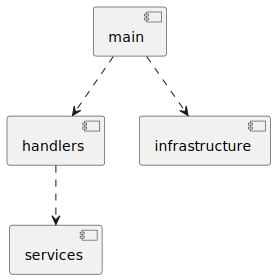

# Architecture

This document provides a small technical overview of the solution. Its intention is to ease the initial review of the solution.

## Overview

The fizzbuzz server is organized into the following packages:

- handlers: responsible for validating requests before calling the services and generating an http response;
- services: responsible for running the actual "domain" logic, e.g. fizzbuzz;
- infrastructure: responsible for running the http server and defining generic wrappers like
    - logging: logs basic request info;
    - stats: submits the request info into a channel to be processed in the background;
- main.go: responsible for capturing flags passed to the program, registering the handlers and starting the server.

